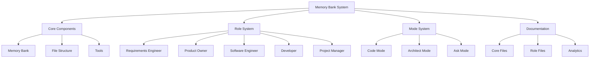

# Memory Bank System Overview
Version: 1.0.0

## Quick Reference
```bash
# Common Commands
UMB                     # Update memory bank
[MEMORY BANK: ACTIVE]   # Active prefix
"Switch to RE role"     # Switch to Requirements Engineer
"Plan as SWE"          # Plan as Software Engineer
"Code as Dev"          # Code as Developer
"end chat"             # End current session

# Directory Shortcuts
mb/                    # memory-bank/
mb/core/              # Core system files
mb/docs/              # Documentation
mb/<role>/            # Role-specific files

# Role Shortcuts
RE  # Requirements Engineer
PO  # Product Owner
SWE # Software Engineer
Dev # Developer
PM  # Project Manager
```

## Table of Contents
- [Memory Bank System Overview](#memory-bank-system-overview)
  - [Quick Reference](#quick-reference)
  - [Table of Contents](#table-of-contents)
  - [System Architecture](#system-architecture)
  - [Component Overview](#component-overview)
    - [1. Core System Files](#1-core-system-files)
    - [2. Role System](#2-role-system)
    - [3. Mode System](#3-mode-system)
    - [4. Directory Structure](#4-directory-structure)
  - [Role-Specific Documentation](#role-specific-documentation)
    - [Requirements Engineer (RE)](#requirements-engineer-re)
    - [Product Owner (PO)](#product-owner-po)
    - [Software Engineer (SWE)](#software-engineer-swe)
    - [Developer (Dev)](#developer-dev)
    - [Project Manager (PM)](#project-manager-pm)
  - [Mode-Specific Behaviors](#mode-specific-behaviors)
    - [Code Mode](#code-mode)
    - [Architect Mode](#architect-mode)
    - [Ask Mode](#ask-mode)
  - [Command Reference](#command-reference)
    - [Role Switching](#role-switching)
    - [Memory Bank Commands](#memory-bank-commands)
  - [Configuration Files](#configuration-files)
    - [Global Configuration](#global-configuration)
    - [Project Configuration](#project-configuration)
    - [Role Rules](#role-rules)
  - [Recent Changes](#recent-changes)
    - [Name Change to Iris](#name-change-to-iris)
    - [Role System Enhancement](#role-system-enhancement)
  - [Installation Guide](#installation-guide)
    - [System Setup](#system-setup)
    - [Role Setup](#role-setup)
  - [User Workflow](#user-workflow)
    - [Session Start](#session-start)
    - [Task Execution](#task-execution)
    - [Session Management](#session-management)
    - [User Commands](#user-commands)
    - [Flow Control](#flow-control)
  - [Improvement Ideas](#improvement-ideas)
  - [Performance Optimization](#performance-optimization)
  - [Troubleshooting Guide](#troubleshooting-guide)
    - [Common Issues](#common-issues)
    - [Best Practices](#best-practices)
    - [Recovery Procedures](#recovery-procedures)
  - [Role Simplification Guide](#role-simplification-guide)
    - [Core Role Requirements](#core-role-requirements)
    - [Migration Strategy](#migration-strategy)
  - [Global Settings \& Tools](#global-settings--tools)
    - [Auto-Approved Settings](#auto-approved-settings)
    - [System Limits](#system-limits)
    - [Experimental Features](#experimental-features)
  - [For New AI Sessions](#for-new-ai-sessions)
    - [First-Time Setup](#first-time-setup)
    - [Understanding the System](#understanding-the-system)
    - [Common Scenarios](#common-scenarios)
  - [Version Control](#version-control)
  - [Test Commands](#test-commands)
  - [MCP Server Configuration](#mcp-server-configuration)
  - [Change Log 📝](#change-log-)


## System Architecture


## Component Overview

### 1. Core System Files
| File | Purpose | Location |
|------|----------|----------|
| .clinerules | Global rules and behaviors | /memory-bank-template/ |
| mode-instructions.md | Mode and role definitions | /memory-bank-template/ |
| custom_modes.json | Mode configurations | /memory-bank-template/ |
| role-definitions.md | Role specifications | /memory-bank-template/ |

### 2. Role System
| Role | Purpose | Key Files |
|------|----------|-----------|
| Requirements Engineer (RE) | Requirements and scope management | .clinerules-re |
| Product Owner (PO) | Pattern approval and decisions | .clinerules-po |
| Software Engineer (SWE) | Architecture and complex problems | .clinerules-swe |
| Developer (Dev) | Implementation and basic debugging | .clinerules-dev |
| Project Manager (PM) | Progress tracking and status | .clinerules-pm |

### 3. Mode System
| Mode | Purpose | Available Roles |
|------|----------|----------------|
| Code | Implementation | SWE, Dev |
| Architect | Design | RE, PO, SWE |
| Ask | Explanation | All roles |

### 4. Directory Structure
```
memory-bank/
├── core/                 # Core system files
├── ai-evolution/         # AI learning tracking
├── analytics/           # System analytics
├── knowledge-base/      # Patterns and guides
└── ideas/              # Future improvements
```

## Role-Specific Documentation

### Requirements Engineer (RE)
- **Purpose**: Document and manage requirements
- **Tools**: read_file, browser_action, use_mcp_tool
- **Key Files**: requirements/, constraints/, scope/
- **Documentation**: Memory requirements, constraints

### Product Owner (PO)
- **Purpose**: Approve patterns and decisions
- **Tools**: read_file, browser_action, use_mcp_tool
- **Key Files**: patterns/, decisions/, direction/
- **Documentation**: Pattern approvals, decisions

### Software Engineer (SWE)
- **Purpose**: Architecture and complex problems
- **Tools**: All tools
- **Key Files**: design/, architecture/, solutions/
- **Documentation**: Technical solutions, architecture

### Developer (Dev)
- **Purpose**: Implementation and basic debugging
- **Tools**: All tools
- **Key Files**: implementation/, guides/, integration/
- **Documentation**: Code implementation, guides

### Project Manager (PM)
- **Purpose**: Track progress and status
- **Tools**: read_file, browser_action, use_mcp_tool
- **Key Files**: status/, tracking/, timeline/
- **Documentation**: Progress tracking, timelines

## Mode-Specific Behaviors

### Code Mode
- Implementation focus
- Full tool access for SWE/Dev
- Documentation updates for others
- Pattern tracking required

### Architect Mode
- Design focus
- Pattern approval
- No implementation
- Documentation focus

### Ask Mode
- Explanation focus
- All roles can explain their domain
- No implementation
- Resource access

## Command Reference

### Role Switching
```bash
# Explicit switching
"Switch to [role] role"

# With mode combination
"Plan as [role]"
"Code as [role]"
```

### Memory Bank Commands
```bash
# Update memory bank
"update memory bank"
"UMB"

# Memory bank prefix
[MEMORY BANK: ACTIVE]
```

## Configuration Files

### Global Configuration
Location: ~/.cursor-server/data/User/globalStorage/rooveterinaryinc.roo-cline/settings/cline_custom_modes.json (Note: Path maintained for system compatibility)
Purpose: Define global role availability for Iris

### Project Configuration
Location: .roomodes (Note: Filename maintained for system compatibility)
Purpose: Project-specific Iris role configurations

### Role Rules
Location: .clinerules-*
Purpose: Role-specific behaviors and access

## Recent Changes

### Name Change to Iris
- System renamed from Cline/Roo to Iris
- Updated all role definitions
- Updated mode instructions
- Updated configuration files

### Role System Enhancement
- Added RE and PO roles
- Split SWE/Dev responsibilities
- Enhanced PM capabilities
- Added role-specific documentation

## Installation Guide

### System Setup
1. Global Installation
```bash
# Copy configuration files (Note: Paths maintained for system compatibility)
cp .clinerules* ~/.cursor-server/data/User/globalStorage/rooveterinaryinc.roo-cline/settings/
cp custom_modes.json ~/.cursor-server/data/User/globalStorage/rooveterinaryinc.roo-cline/settings/
```

2. Project Installation
```bash
# Copy project-specific files
cp .roomodes /path/to/your/project/
```

3. Directory Setup
```bash
# Create memory bank structure
mkdir -p memory-bank/{core,ai-evolution,analytics,knowledge-base,ideas}
```

### Role Setup
1. Configure Global Roles
- Edit custom_modes.json (Note: File maintained as cline_custom_modes.json for system compatibility)
- Add role definitions
- Set available tools
- Define custom instructions

2. Configure Project Roles
- Edit .roomodes
- Customize for project
- Set project-specific instructions
- Define role boundaries

## User Workflow

### Session Start
1. User starts new chat
2. System checks for memory bank
3. If missing, system creates it
4. System loads appropriate role/mode

### Task Execution
1. User provides task
2. System determines role/mode
3. System executes with memory bank awareness
4. System documents changes

### Session Management
1. During Session:
   - Use [MEMORY BANK: ACTIVE] prefix
   - Document all changes
   - Track patterns
   - Maintain context

2. Session End:
   - Use "update memory bank" or "UMB"
   - System documents final state
   - Prepares for next session

3. New Session:
   - Fresh start with memory bank
   - Load previous context
   - Continue work

### User Commands
```bash
# Start new task
"<task description>"

# Switch roles
"Switch to [role] role"
"Plan as [role]"
"Code as [role]"

# Update memory bank
"update memory bank"
"UMB"

# End session
"end chat"
"new task"
```

### Flow Control
1. Task Start:
   - User provides task
   - System determines role
   - System loads context

2. During Task:
   - System maintains context
   - User can switch roles
   - System tracks changes

3. Task End:
   - System updates memory bank
   - Documents completion
   - Prepares for next task

## Improvement Ideas

1. Role System
- Add more specialized roles
- Enhanced role interactions
- Better role transition

2. Documentation
- Automated updates
- Better cross-referencing
- Enhanced search

3. Integration
- Better tool integration
- Enhanced MCP support
- Improved automation

## Performance Optimization
1. Memory Management
   - Improved context loading
   - Better state tracking
   - Enhanced persistence

2. Tool Integration
   - More MCP tools
   - Better browser integration
   - Enhanced file operations

3. Documentation
   - Automated updates
   - Real-time sync
   - Better search

4. User Experience
   - Smoother role transitions
   - Better context awareness
   - Enhanced error handling

5. Session Management
   - Better state preservation
   - Improved context switching
   - Enhanced role memory

## Troubleshooting Guide

### Common Issues

1. Memory Bank Not Found
```bash
# Symptoms
- System can't find memory bank
- Missing documentation error

# Solutions
- Check directory structure
- Run initialization
- Verify file permissions
```

2. Role Switching Issues
```bash
# Symptoms
- Role switch fails
- Incorrect role loaded

# Solutions
- Verify role configuration
- Check .clinerules files
- Ensure proper mode
```

3. Context Loss
```bash
# Symptoms
- System loses context
- Incomplete documentation

# Solutions
- Use "UMB" command
- Check file updates
- Verify memory bank state
```

4. Tool Access Issues
```bash
# Symptoms
- Tools not available
- Permission errors

# Solutions
- Check role permissions
- Verify tool configuration
- Update role settings
```

### Best Practices

1. Session Management
- Always use "UMB" before ending
- Verify documentation updates
- Check role state

2. Role Usage
- Use appropriate role for task
- Switch roles when needed
- Maintain role boundaries

3. Documentation
- Keep files updated
- Use proper formats
- Follow patterns

4. Error Prevention
- Regular backups
- Consistent updates
- Clear documentation

### Recovery Procedures

1. Context Recovery
```bash
# Steps
1. Check memory bank files
2. Verify last state
3. Load appropriate role
4. Resume with context
```

2. Role Reset
```bash
# Steps
1. End current session
2. Clear role state
3. Reload configuration
4. Start new session
```

3. System Reset
```bash
# Steps
1. Backup memory bank
2. Clear configurations
3. Reinstall roles
4. Restore memory bank
```

## Role Simplification Guide

### Core Role Requirements
1. File Access
```bash
# Each role needs only
- READ_ACCESS=*.md
- WRITE_ACCESS=memory-bank/role/*.md
- BACKUP_REQUIRED=true
- VERSION_CONTROL=true
```

2. Documentation Focus
```bash
# Keep requirements minimal
RE: Must document requirements
PO: Must approve patterns
SWE: Must document design
Dev: Must document implementation
PM: Must track progress
```

3. Role Boundaries
```bash
# Clear separation
- Each role has specific directory
- Limited write access
- Clear responsibilities
- Simple documentation rules
```

### Migration Strategy
1. Simplify Existing Roles
- Remove unnecessary complexity
- Focus on core responsibilities
- Keep documentation minimal
- Maintain clear boundaries

2. Role Transition
- Gradually simplify roles
- Update documentation
- Train users on changes
- Monitor effectiveness

3. Documentation Updates
- Streamline requirements
- Focus on essentials
- Keep format simple
- Maintain clarity

## Global Settings & Tools

### Auto-Approved Settings
```bash
# Browser Actions
- Auto-approve enabled
- Viewport: 1280x800
- Screenshot quality: 47%

# Command Auto-Approval
- Allowed commands:
  npm test
  npm install
  tsc
  git log/diff/show
  lsof
  cd
  npm run dev/build/start
  node
  pwd
  npm list
  cp
  echo

# API Settings
- Auto-retry failed requests
- Retry delay: 5s
- Rate limit: 2s

# Tool Settings
- Auto-approve MCP tools
- Auto-approve mode switching
- Auto-approve allowed execute operations
```

### System Limits
```bash
# Output Limits
- Terminal: 5000 lines
- Open tabs: 500 files

# Performance
- Write delay: enabled
- Match precision: 100%
- Sound effects: 50% volume
```

### Experimental Features
```bash
# Enabled Features
- Unified diff strategy
- Checkpoints
- Search and replace
- Insert content tool

# Usage Notes
- Use with caution
- Review changes carefully
- Backup important files
```

## For New AI Sessions

### First-Time Setup
1. Memory Bank Check
```bash
# On first message, check for
- memory-bank/ directory
- Required files
- Role configuration
```

2. Context Loading
```bash
# Load in order
1. Global configuration
2. Project configuration
3. Role-specific rules
4. Current memory bank state
```

3. Role Determination
```bash
# Analyze user's first message
- Task type -> Appropriate role
- Mode requirements
- Tool needs
```

### Understanding the System
1. Key Concepts
- Memory Bank: Persistent storage
- Roles: Specialized capabilities
- Modes: Operation contexts
- Tools: Available actions

2. Documentation Structure
- Core files: System configuration
- Role files: Role-specific data
- Memory files: Project state
- Analytics: System learning

3. Operation Flow
```bash
# Basic flow
1. Receive task
2. Load context
3. Determine role
4. Execute with memory awareness
5. Document changes
6. Update memory bank
```

### Common Scenarios
1. New Project
```bash
# Steps
1. Create memory bank
2. Initialize structure
3. Set up role files
4. Begin documentation
```

2. Existing Project
```bash
# Steps
1. Load memory bank
2. Check last state
3. Resume work
4. Maintain context
```

3. Role Switching
```bash
# When to switch
- Task type changes
- Need different tools
- Different expertise needed
```

## Version Control
```bash
# Version Numbers
System: 1.0.0
Roles: 1.0.0
Settings: 1.0.0
MCP: 1.0.0
```

## Test Commands
```bash
# Verify Installation
test-memory-bank          # Check memory bank structure
test-roles               # Verify role configurations
test-settings           # Validate global settings
test-mcp                # Check MCP connections

# Verify Features
test-experimental       # Test experimental features
test-auto-approve      # Verify auto-approved commands
test-browser           # Check browser settings
test-api               # Validate API settings
```

## MCP Server Configuration
```bash
# Memory Context
server: memory-context
port: default
features:
  - context tracking
  - state management
  - persistence

# Token Optimizer
server: token-optimizer
port: default
features:
  - token counting
  - optimization
  - analytics
```

## Change Log 📝
- [2025-02-16]: Initial system setup with roles and modes
- [2025-02-16]: Added global settings and auto-approved commands
- [2025-02-16]: Integrated experimental features
- [2025-02-16]: Added test commands and MCP configuration
