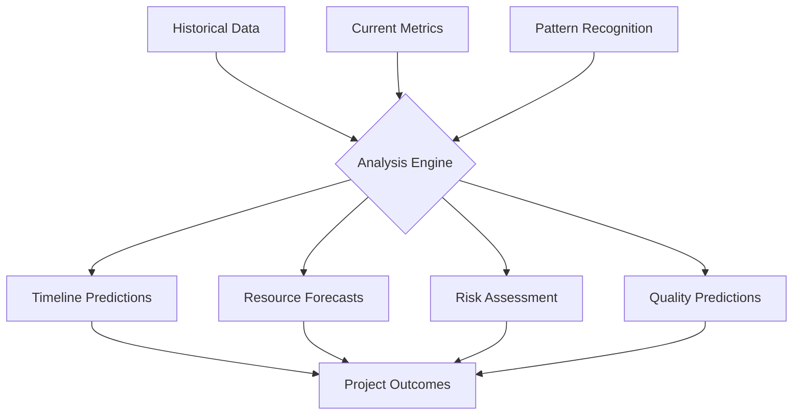

# Predictive Analytics
Version: 1.0.0
Last Updated: [Timestamp]

## Project Forecasting 📈

## Timeline Predictions ⏱️
### MVP Completion
1. Current Estimate
   ├── Predicted: [Date ± Range]
   ├── Confidence: [📊 0-100%]
   ├── Risk Factors: [List]
   └── Mitigation: [Strategy]

2. Historical Accuracy
   ├── Previous Estimates: [List]
   ├── Actual Results: [List]
   ├── Variance: [%]
   └── Learning Applied: [List]

## Resource Forecasting 📊
### Development Resources
1. AI Assistance
   ├── Current Usage: [%]
   ├── Projected Need: [%]
   ├── Optimization: [%]
   └── Recommendations: [List]

2. Tool Usage
   ├── Current Load: [%]
   ├── Projected Need: [%]
   ├── Bottlenecks: [List]
   └── Solutions: [List]

## Risk Prediction 🎲
### Technical Risks
1. Implementation Risks
   ├── Probability: [%]
   ├── Impact: [High | Medium | Low]
   ├── Early Indicators: [List]
   └── Prevention: [Strategy]

2. Integration Risks
   ├── Probability: [%]
   ├── Impact: [High | Medium | Low]
   ├── Early Indicators: [List]
   └── Prevention: [Strategy]

## Quality Forecasting 🎯
### Code Quality
1. Predicted Metrics
   ├── Coverage: [%]
   ├── Maintainability: [Score]
   ├── Performance: [Score]
   └── Recommendations: [List]

2. Historical Trends
   ├── Past Quality: [Graph]
   ├── Current Trend: [📈 | 📉]
   ├── Influencing Factors: [List]
   └── Improvements: [List]

## Performance Predictions ⚡
### System Performance
1. Response Times
   ├── Current: [ms]
   ├── Projected: [ms]
   ├── Bottlenecks: [List]
   └── Optimizations: [List]

2. Resource Usage
   ├── Current: [%]
   ├── Projected: [%]
   ├── Scaling Needs: [List]
   └── Solutions: [List]

## Pattern-Based Predictions 🧩
### Implementation Patterns
1. Success Probability
   ├── Pattern: [Name]
   ├── Historical Success: [%]
   ├── Current Context: [Match %]
   └── Recommendation: [Strategy]

2. Risk Patterns
   ├── Pattern: [Name]
   ├── Historical Issues: [List]
   ├── Prevention Rate: [%]
   └── Mitigation: [Strategy]

## AI Confidence Levels 🤖
### Prediction Confidence
1. Timeline Estimates
   ├── Confidence: [📊 0-100%]
   ├── Factors: [List]
   ├── Uncertainty: [%]
   └── Improvement: [Strategy]

2. Quality Predictions
   ├── Confidence: [📊 0-100%]
   ├── Factors: [List]
   ├── Uncertainty: [%]
   └── Improvement: [Strategy]

## Improvement Tracking 📈
### Prediction Accuracy
1. Timeline Accuracy
   ├── Initial: [%]
   ├── Current: [%]
   ├── Improvement: [%]
   └── Learning: [List]

2. Risk Prediction
   ├── Initial: [%]
   ├── Current: [%]
   ├── Improvement: [%]
   └── Learning: [List]

## Action Items 📋
### Immediate Actions
1. High Priority
   ├── Action: [Description]
   ├── Impact: [High | Medium | Low]
   ├── Timeline: [Duration]
   └── Resources: [List]

2. Medium Priority
   ├── Action: [Description]
   ├── Impact: [High | Medium | Low]
   ├── Timeline: [Duration]
   └── Resources: [List]

## Change Log 📝
- [Timestamp]: [Change description]
- [Timestamp]: [Change description]
