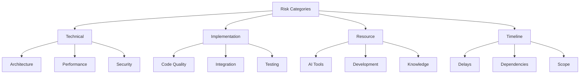

# Risk Assessment
Version: 1.0.0
Last Updated: [Timestamp]

## Risk Overview 📊

## Technical Risks 🔧
### Architecture Risks
1. Pattern Implementation
   ├── Risk Level: [High | Medium | Low]
   ├── Probability: [%]
   ├── Impact: [Score]
   ├── Mitigation: [Strategy]
   └── Status: [Active | Monitored | Resolved]

2. System Design
   ├── Risk Level: [High | Medium | Low]
   ├── Probability: [%]
   ├── Impact: [Score]
   ├── Mitigation: [Strategy]
   └── Status: [Active | Monitored | Resolved]

### Performance Risks
1. Scalability
   ├── Risk Level: [High | Medium | Low]
   ├── Probability: [%]
   ├── Impact: [Score]
   ├── Mitigation: [Strategy]
   └── Status: [Active | Monitored | Resolved]

2. Resource Usage
   ├── Risk Level: [High | Medium | Low]
   ├── Probability: [%]
   ├── Impact: [Score]
   ├── Mitigation: [Strategy]
   └── Status: [Active | Monitored | Resolved]

## Implementation Risks ⚠️
### Code Quality
1. Maintainability
   ├── Risk Level: [High | Medium | Low]
   ├── Probability: [%]
   ├── Impact: [Score]
   ├── Mitigation: [Strategy]
   └── Status: [Active | Monitored | Resolved]

2. Technical Debt
   ├── Risk Level: [High | Medium | Low]
   ├── Probability: [%]
   ├── Impact: [Score]
   ├── Mitigation: [Strategy]
   └── Status: [Active | Monitored | Resolved]

## Resource Risks 📈
### AI Tool Risks
1. Availability
   ├── Risk Level: [High | Medium | Low]
   ├── Probability: [%]
   ├── Impact: [Score]
   ├── Mitigation: [Strategy]
   └── Status: [Active | Monitored | Resolved]

2. Performance
   ├── Risk Level: [High | Medium | Low]
   ├── Probability: [%]
   ├── Impact: [Score]
   ├── Mitigation: [Strategy]
   └── Status: [Active | Monitored | Resolved]

## Timeline Risks ⏱️
### Project Delays
1. Development Delays
   ├── Risk Level: [High | Medium | Low]
   ├── Probability: [%]
   ├── Impact: [Score]
   ├── Mitigation: [Strategy]
   └── Status: [Active | Monitored | Resolved]

2. Integration Delays
   ├── Risk Level: [High | Medium | Low]
   ├── Probability: [%]
   ├── Impact: [Score]
   ├── Mitigation: [Strategy]
   └── Status: [Active | Monitored | Resolved]

## AI-Identified Risks 🤖
### Pattern-Based Risks
1. Historical Patterns
   ├── Similar Cases: [Number]
   ├── Success Rate: [%]
   ├── Failure Points: [List]
   └── Prevention: [Strategy]

2. Current Indicators
   ├── Risk Signals: [List]
   ├── Confidence: [%]
   ├── Impact Areas: [List]
   └── Mitigation: [Strategy]

## Risk Monitoring 📊
### Active Risks
1. High Priority
   ├── Risk: [Description]
   ├── Current Status: [Status]
   ├── Trend: [📈 | 📉]
   └── Actions: [List]

2. Medium Priority
   ├── Risk: [Description]
   ├── Current Status: [Status]
   ├── Trend: [📈 | 📉]
   └── Actions: [List]

## Mitigation Strategies 🛡️
### Technical Mitigation
1. Architecture
   ├── Strategy: [Description]
   ├── Implementation: [Steps]
   ├── Success Rate: [%]
   └── Timeline: [Duration]

2. Performance
   ├── Strategy: [Description]
   ├── Implementation: [Steps]
   ├── Success Rate: [%]
   └── Timeline: [Duration]

## Risk Metrics 📈
### Risk Trends
1. Overall Risk Level
   ├── Initial: [Score]
   ├── Current: [Score]
   ├── Trend: [📈 | 📉]
   └── Target: [Score]

2. Category Risks
   ├── Technical: [Score]
   ├── Implementation: [Score]
   ├── Resource: [Score]
   └── Timeline: [Score]

## Preventive Measures 🔒
### Risk Prevention
1. Technical Prevention
   ├── Measures: [List]
   ├── Effectiveness: [%]
   ├── Coverage: [%]
   └── Improvements: [List]

2. Process Prevention
   ├── Measures: [List]
   ├── Effectiveness: [%]
   ├── Coverage: [%]
   └── Improvements: [List]

## Change Log 📝
- [Timestamp]: [Change description]
- [Timestamp]: [Change description]
