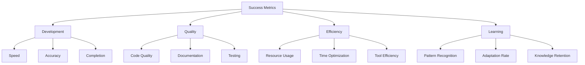

# Success Metrics
Version: 1.0.0
Last Updated: [Timestamp]

## Performance Dashboard 📊

## Development Metrics ⚡
### Implementation Speed
1. Simple Tasks (0-30 Difficulty)
   ├── Average Time: [5-15 minutes]
   ├── Success Rate: [%]
   ├── Quality Score: [0-100]
   └── AI Contribution: [%]

2. Complex Tasks (71-100 Difficulty)
   ├── Average Time: [30-90 minutes]
   ├── Success Rate: [%]
   ├── Quality Score: [0-100]
   └── AI Contribution: [%]

### Code Quality
1. Static Analysis
   ├── Complexity Score: [0-100]
   ├── Maintainability: [0-100]
   ├── Best Practices: [%]
   └── Improvements: [List]

2. Dynamic Analysis
   ├── Performance: [Score]
   ├── Memory Usage: [Score]
   ├── Efficiency: [Score]
   └── Optimizations: [List]

## Efficiency Metrics 📈
### Resource Optimization
1. AI Tools
   ├── Usage: [%]
   ├── Effectiveness: [%]
   ├── Time Saved: [Hours]
   └── ROI: [Calculation]

2. Development Tools
   ├── Usage: [%]
   ├── Effectiveness: [%]
   ├── Time Saved: [Hours]
   └── ROI: [Calculation]

### Time Management
1. Task Distribution
   ├── Planning: [%]
   ├── Implementation: [%]
   ├── Testing: [%]
   └── Documentation: [%]

2. Optimization Areas
   ├── Current: [Hours/Task]
   ├── Target: [Hours/Task]
   ├── Improvement: [%]
   └── Strategy: [Plan]

## Quality Metrics 🎯
### Code Standards
1. Static Code Analysis
   ├── Lint Score: [0-100]
   ├── Complexity: [Score]
   ├── Coverage: [%]
   └── Improvements: [List]

2. Dynamic Analysis
   ├── Performance: [Score]
   ├── Memory Usage: [Score]
   ├── Error Rate: [%]
   └── Optimizations: [List]

### Documentation Quality
1. Technical Documentation
   ├── Coverage: [%]
   ├── Clarity: [Score]
   ├── Completeness: [%]
   └── Updates Needed: [List]

2. Code Documentation
   ├── Coverage: [%]
   ├── Quality: [Score]
   ├── Usefulness: [Score]
   └── Improvements: [List]

## Learning Effectiveness 📚
### Pattern Recognition
1. Implementation Patterns
   ├── Recognition Rate: [%]
   ├── Application Success: [%]
   ├── Adaptation Speed: [Score]
   └── Improvements: [List]

2. Problem Patterns
   ├── Recognition Rate: [%]
   ├── Resolution Speed: [Score]
   ├── Prevention Rate: [%]
   └── Learnings: [List]

### Knowledge Application
1. Technical Knowledge
   ├── Understanding: [%]
   ├── Application: [%]
   ├── Retention: [%]
   └── Growth: [%/week]

2. Domain Knowledge
   ├── Understanding: [%]
   ├── Application: [%]
   ├── Retention: [%]
   └── Growth: [%/week]

## Tool Effectiveness 🛠️
### AI Tools
1. MCP Usage
   ├── Frequency: [Times/day]
   ├── Success Rate: [%]
   ├── Time Saved: [Hours]
   └── Impact: [Score]

2. Code Generation
   ├── Accuracy: [%]
   ├── Quality: [Score]
   ├── Time Saved: [Hours]
   └── Improvements: [List]

### Development Tools
1. IDE Integration
   ├── Efficiency: [Score]
   ├── Feature Usage: [%]
   ├── Time Saved: [Hours]
   └── Optimization: [List]

2. Testing Tools
   ├── Coverage: [%]
   ├── Effectiveness: [Score]
   ├── Time Saved: [Hours]
   └── Improvements: [List]

## Success Indicators 🎯
### Project Goals
1. MVP Features
   ├── Completion: [%]
   ├── Quality: [Score]
   ├── Timeline: [Status]
   └── Adjustments: [List]

2. Launch Requirements
   ├── Completion: [%]
   ├── Quality: [Score]
   ├── Timeline: [Status]
   └── Adjustments: [List]

## Change Log 📝
- [Timestamp]: [Change description]
- [Timestamp]: [Change description]
