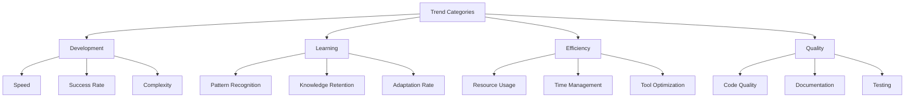

# Trend Analysis
Version: 1.0.0
Last Updated: [Timestamp]

## Performance Trends 📈


## Development Trends ⚡
### Implementation Speed
1. Simple Tasks
   ```mermaid
   graph TD
       A[Time Trend] --> B[Initial: 30m]
       B --> C[Current: 5m]
       C --> D[Target: 3m]
       D --> E[Projected: 2m]
   ```
   ├── Improvement Rate: [%/week]
   ├── Success Correlation: [%]
   └── Optimization: [Strategy]

2. Complex Tasks
   ```mermaid
   graph TD
       A[Time Trend] --> B[Initial: 4h]
       B --> C[Current: 45m]
       C --> D[Target: 30m]
       D --> E[Projected: 20m]
   ```
   ├── Improvement Rate: [%/week]
   ├── Success Correlation: [%]
   └── Optimization: [Strategy]

## Learning Trends 📚
### Pattern Recognition
1. Implementation Patterns
   ├── Initial Rate: [patterns/hour]
   ├── Current Rate: [patterns/hour]
   ├── Growth: [%/week]
   └── Projection: [Target]

2. Problem Patterns
   ├── Initial Rate: [patterns/hour]
   ├── Current Rate: [patterns/hour]
   ├── Growth: [%/week]
   └── Projection: [Target]

### Knowledge Retention
1. Technical Knowledge
   ```mermaid
   graph TD
       A[Retention Trend] --> B[Initial: 60%]
       B --> C[Current: 85%]
       C --> D[Target: 95%]
       D --> E[Projected: 98%]
   ```
   ├── Growth Rate: [%/week]
   ├── Application Success: [%]
   └── Optimization: [Strategy]

2. Domain Knowledge
   ```mermaid
   graph TD
       A[Retention Trend] --> B[Initial: 40%]
       B --> C[Current: 70%]
       C --> D[Target: 90%]
       D --> E[Projected: 95%]
   ```
   ├── Growth Rate: [%/week]
   ├── Application Success: [%]
   └── Optimization: [Strategy]

## Efficiency Trends ⚙️
### Resource Optimization
1. AI Tool Usage
   ├── Initial Efficiency: [%]
   ├── Current Efficiency: [%]
   ├── Improvement Rate: [%/week]
   └── Optimization: [Strategy]

2. Development Tools
   ├── Initial Efficiency: [%]
   ├── Current Efficiency: [%]
   ├── Improvement Rate: [%/week]
   └── Optimization: [Strategy]

### Time Management
1. Task Completion
   ├── Initial Speed: [time/task]
   ├── Current Speed: [time/task]
   ├── Improvement Rate: [%/week]
   └── Optimization: [Strategy]

2. Process Efficiency
   ├── Initial Rate: [tasks/day]
   ├── Current Rate: [tasks/day]
   ├── Improvement Rate: [%/week]
   └── Optimization: [Strategy]

## Quality Trends 🎯
### Code Quality
1. Static Analysis
   ```mermaid
   graph TD
       A[Quality Trend] --> B[Initial: 70%]
       B --> C[Current: 85%]
       C --> D[Target: 95%]
       D --> E[Projected: 98%]
   ```
   ├── Improvement Rate: [%/week]
   ├── Issue Reduction: [%]
   └── Optimization: [Strategy]

2. Dynamic Analysis
   ```mermaid
   graph TD
       A[Performance Trend] --> B[Initial: 65%]
       B --> C[Current: 80%]
       C --> D[Target: 90%]
       D --> E[Projected: 95%]
   ```
   ├── Improvement Rate: [%/week]
   ├── Optimization Rate: [%]
   └── Strategy: [Plan]

## Tool Evolution 🛠️
### AI Tool Effectiveness
1. MCP Tools
   ├── Usage Trend: [📈 | 📉]
   ├── Efficiency Trend: [📈 | 📉]
   ├── Impact Trend: [📈 | 📉]
   └── Optimization: [Strategy]

2. Code Generation
   ├── Quality Trend: [📈 | 📉]
   ├── Speed Trend: [📈 | 📉]
   ├── Accuracy Trend: [📈 | 📉]
   └── Optimization: [Strategy]

## Pattern Evolution 🧩
### Implementation Patterns
1. Success Rates
   ├── Initial: [%]
   ├── Current: [%]
   ├── Growth Rate: [%/week]
   └── Projection: [Target]

2. Adaptation Rates
   ├── Initial: [time/pattern]
   ├── Current: [time/pattern]
   ├── Improvement: [%/week]
   └── Projection: [Target]

## Future Projections 🔮
### Development Metrics
1. Speed
   ├── Current Trend: [📈 | 📉]
   ├── 30-Day Projection: [Metric]
   ├── 90-Day Projection: [Metric]
   └── Optimization: [Strategy]

2. Quality
   ├── Current Trend: [📈 | 📉]
   ├── 30-Day Projection: [Metric]
   ├── 90-Day Projection: [Metric]
   └── Optimization: [Strategy]

## Change Log 📝
- [Timestamp]: [Change description]
- [Timestamp]: [Change description]
