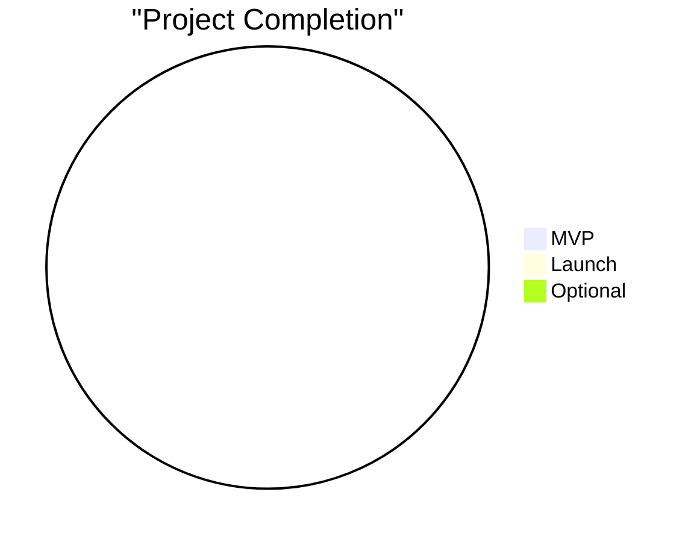
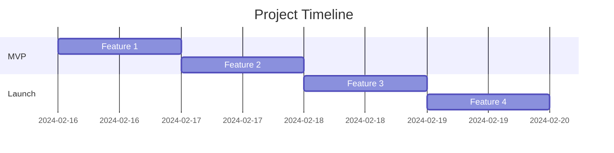

# Project Progress
Version: 1.0.0
Last Updated: [Timestamp]

## Quick Stats 📊

## Progress Overview 🎯
### MVP Features
1. [Feature Name]
   ├── Progress: [▓▓▓▓▓░░░░░] 50%
   ├── Difficulty: [⚡ 0-100]
   ├── Time Estimate: [🕒 AI: 30m | Traditional: 4h]
   └── Status: [✅ Complete | ⚠️ In Progress | ❌ Not Started]

2. [Feature Name]
   ├── Progress: [▓▓▓▓▓░░░░░] 50%
   ├── Difficulty: [⚡ 0-100]
   ├── Time Estimate: [🕒 AI: 30m | Traditional: 4h]
   └── Status: [✅ Complete | ⚠️ In Progress | ❌ Not Started]

### Launch Requirements 🚀
1. [Feature Name]
   ├── Progress: [▓▓▓▓▓░░░░░] 50%
   ├── Difficulty: [⚡ 0-100]
   ├── Time Estimate: [🕒 AI: 30m | Traditional: 4h]
   └── Status: [✅ Complete | ⚠️ In Progress | ❌ Not Started]

### Optional Enhancements ⭐
1. [Feature Name]
   ├── Progress: [▓▓▓▓▓░░░░░] 50%
   ├── Difficulty: [⚡ 0-100]
   ├── Time Estimate: [🕒 AI: 30m | Traditional: 4h]
   └── Status: [✅ Complete | ⚠️ In Progress | ❌ Not Started]

## Timeline View 📅

## AI Analysis 🤖
### Performance Metrics
1. Development Speed
   ├── Current: [Features/week]
   ├── Target: [Features/week]
   ├── Trend: [📈 Improving | 📉 Declining]
   └── Optimization: [Strategy]

2. Quality Metrics
   ├── Code Coverage: [%]
   ├── Bug Rate: [Number/week]
   ├── Review Time: [Hours]
   └── Improvement: [Strategy]

### Predictive Analysis
1. Completion Forecast
   ├── MVP: [Date ± Range]
   ├── Launch: [Date ± Range]
   ├── Confidence: [📊 0-100%]
   └── Factors: [List]

2. Risk Assessment
   ├── Technical: [High | Medium | Low]
   ├── Timeline: [High | Medium | Low]
   ├── Resource: [High | Medium | Low]
   └── Mitigation: [Strategy]

## Blockers & Dependencies 🚧
### Active Blockers
1. [Blocker Name]
   ├── Impact: [High | Medium | Low]
   ├── Status: [Active | Investigating | Resolved]
   ├── Dependencies: [List]
   └── Resolution: [Plan]

### Dependencies
1. [Dependency Name]
   ├── Type: [External | Internal]
   ├── Status: [✅ | ⚠️ | ❌]
   ├── Impact: [High | Medium | Low]
   └── Action: [Required steps]

## Resource Utilization 📈
### Development Resources
1. AI Tools
   ├── Usage: [%]
   ├── Efficiency: [%]
   ├── Cost: [Metric]
   └── Optimization: [Strategy]

2. Human Resources
   ├── Capacity: [%]
   ├── Efficiency: [%]
   ├── Focus Areas: [List]
   └── Optimization: [Strategy]

## Quality Metrics 🎯
### Code Quality
1. Testing
   ├── Coverage: [%]
   ├── Pass Rate: [%]
   ├── Performance: [Metric]
   └── Improvements: [List]

2. Reviews
   ├── Coverage: [%]
   ├── Feedback: [Metrics]
   ├── Implementation: [%]
   └── Impact: [Analysis]

## Optimization Opportunities 💡
### Identified Opportunities
1. [Area]
   ├── Current: [Metric]
   ├── Target: [Metric]
   ├── Impact: [High | Medium | Low]
   └── Implementation: [Plan]

### AI Suggestions
1. [Suggestion]
   ├── Benefit: [Analysis]
   ├── Effort: [Estimate]
   ├── ROI: [Calculation]
   └── Priority: [High | Medium | Low]

## Change Log 📝
- [Timestamp]: [Change description]
- [Timestamp]: [Change description]
