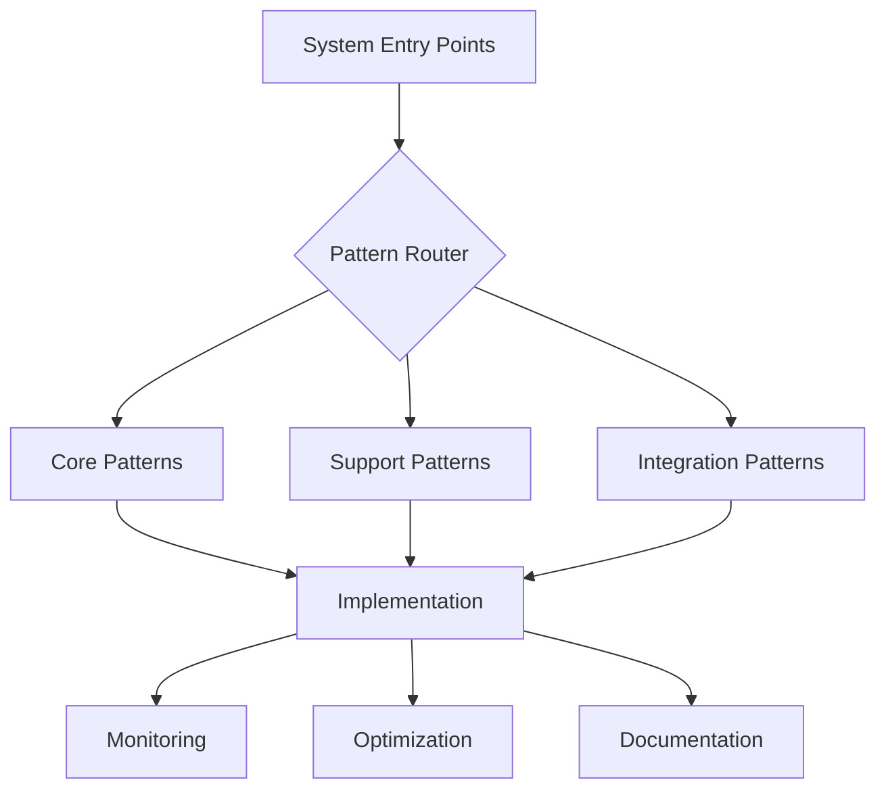

# System Patterns
Version: 1.0.0
Last Updated: [Timestamp]

## Architecture Overview 🏗️


## Core Patterns 🎯
### Pattern Categories
1. Implementation Patterns
   ```typescript
   interface ImplementationPattern {
     name: string;
     useCase: string[];
     complexity: number; // 0-100
     successRate: number; // 0-100
     aiConfidence: number; // 0-100
     timeEstimate: {
       aiAssisted: string;
       traditional: string;
     };
   }
   ```

2. Error Handling Patterns
   ```typescript
   interface ErrorPattern {
     scenario: string;
     detection: string[];
     recovery: string[];
     prevention: string[];
     aiLearnings: {
       similarCases: number;
       successfulSolutions: number;
       recommendedApproach: string;
     };
   }
   ```

## AI Pattern Recognition 🤖
### Learning Metrics
1. Pattern Success Rate
   ├── Implementation: [%]
   ├── Error Handling: [%]
   ├── Performance: [%]
   └── Integration: [%]

2. Pattern Adaptation
   ├── Recognition Speed: [ms]
   ├── Accuracy: [%]
   ├── Improvement Rate: [%/week]
   └── Knowledge Base: [Size]

## Implementation Strategies 📋
### Code Patterns
```typescript
// Example Pattern Implementation
function patternImplementation<T>(config: PatternConfig): PatternResult<T> {
  // Pattern structure
  const pattern = {
    setup: () => {
      // Initialization logic
    },
    execute: () => {
      // Core pattern logic
    },
    cleanup: () => {
      // Cleanup logic
    }
  };

  // Pattern monitoring
  const monitoring = {
    performance: trackPerformance(),
    errors: handleErrors(),
    metrics: collectMetrics()
  };

  return {
    pattern,
    monitoring,
    documentation: generateDocs()
  };
}
```

### Integration Patterns
```typescript
// Integration Pattern Template
interface IntegrationPattern {
  source: string;
  target: string;
  protocol: string;
  validation: () => boolean;
  errorHandling: () => void;
  monitoring: () => Metrics;
}
```

## Performance Patterns ⚡
### Optimization Strategies
1. Resource Management
   ├── Pattern: [Description]
   ├── Use Case: [Scenario]
   ├── Impact: [High | Medium | Low]
   └── AI Confidence: [📊 0-100%]

2. Caching Strategies
   ├── Pattern: [Description]
   ├── Use Case: [Scenario]
   ├── Impact: [High | Medium | Low]
   └── AI Confidence: [📊 0-100%]

## Error Handling Patterns 🚨
### Recovery Strategies
1. Automatic Recovery
   ├── Trigger: [Condition]
   ├── Action: [Steps]
   ├── Fallback: [Alternative]
   └── Success Rate: [%]

2. Manual Intervention
   ├── Trigger: [Condition]
   ├── Action: [Steps]
   ├── Escalation: [Process]
   └── Resolution Time: [Average]

## Testing Patterns 🧪
### Test Categories
1. Unit Testing
   ```typescript
   interface UnitTestPattern {
     scope: string;
     setup: () => void;
     execution: () => void;
     validation: () => boolean;
     cleanup: () => void;
   }
   ```

2. Integration Testing
   ```typescript
   interface IntegrationTestPattern {
     components: string[];
     dependencies: string[];
     setup: () => void;
     execution: () => void;
     validation: () => boolean;
     cleanup: () => void;
   }
   ```

## Documentation Patterns 📚
### Auto-Documentation
1. Code Documentation
   ├── Pattern: [Template]
   ├── Generator: [Tool]
   ├── Coverage: [%]
   └── Validation: [Process]

2. API Documentation
   ├── Pattern: [Template]
   ├── Generator: [Tool]
   ├── Coverage: [%]
   └── Validation: [Process]

## Monitoring Patterns 📊
### Health Checks
1. System Health
   ├── Metrics: [List]
   ├── Thresholds: [Values]
   ├── Alerts: [Conditions]
   └── Actions: [Steps]

2. Performance Health
   ├── Metrics: [List]
   ├── Thresholds: [Values]
   ├── Alerts: [Conditions]
   └── Actions: [Steps]

## AI Learning Patterns 🧠
### Pattern Evolution
1. Recognition
   ├── Input: [Pattern]
   ├── Analysis: [Process]
   ├── Matching: [Algorithm]
   └── Confidence: [%]

2. Adaptation
   ├── Trigger: [Condition]
   ├── Learning: [Process]
   ├── Validation: [Method]
   └── Implementation: [Strategy]

## Change Log 📝
- [Timestamp]: [Change description]
- [Timestamp]: [Change description]
