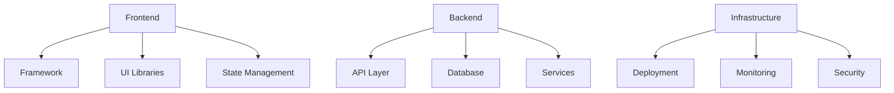

# Technical Context
Version: 1.0.0
Last Updated: [Timestamp]

## Technology Stack Overview 🛠️
### Core Technologies


## Stack Details 📋
### Frontend
1. Framework: [Name]
   ├── Version: [Number]
   ├── Status: [✅ Active | ⚠️ Updating | ❌ Deprecated]
   ├── Performance: [⚡ 0-100]
   └── AI Confidence: [📊 0-100%]

2. UI Components
   ├── Library: [Name]
   ├── Version: [Number]
   ├── Coverage: [%]
   └── Status: [✅ | ⚠️ | ❌]

### Backend
1. API Layer
   ├── Technology: [Name]
   ├── Version: [Number]
   ├── Performance: [⚡ 0-100]
   └── Status: [✅ | ⚠️ | ❌]

2. Database
   ├── Type: [SQL/NoSQL]
   ├── System: [Name]
   ├── Version: [Number]
   └── Status: [✅ | ⚠️ | ❌]

## Development Environment ⚙️
### Required Tools
1. [Tool Name]
   ├── Version: [Number]
   ├── Purpose: [Description]
   ├── Status: [✅ | ⚠️ | ❌]
   └── Alternative: [Tool]

### Dependencies
```json
{
  "core": {
    "dependency1": "^1.0.0",
    "dependency2": "^2.0.0"
  },
  "dev": {
    "devDependency1": "^1.0.0",
    "devDependency2": "^2.0.0"
  }
}
```

## Performance Metrics 📊
### Frontend Metrics
1. Load Time
   ├── Current: [ms]
   ├── Target: [ms]
   ├── Status: [🟢 | 🟡 | 🔴]
   └── Optimization: [Strategy]

2. Bundle Size
   ├── Current: [KB]
   ├── Target: [KB]
   ├── Status: [🟢 | 🟡 | 🔴]
   └── Optimization: [Strategy]

### Backend Metrics
1. Response Time
   ├── Current: [ms]
   ├── Target: [ms]
   ├── Status: [🟢 | 🟡 | 🔴]
   └── Optimization: [Strategy]

2. Resource Usage
   ├── CPU: [%]
   ├── Memory: [MB]
   ├── Status: [🟢 | 🟡 | 🔴]
   └── Optimization: [Strategy]

## AI Technical Analysis 🤖
### Architecture Assessment
1. Pattern Recognition
   ├── Similar Architectures: [Number]
   ├── Success Rate: [%]
   ├── Risk Areas: [List]
   └── Recommendations: [List]

2. Performance Prediction
   ├── Current Trajectory: [📈 | 📉]
   ├── Bottlenecks: [List]
   ├── Optimizations: [List]
   └── Impact: [High | Medium | Low]

### Technical Debt
1. Identified Issues
   ├── Severity: [High | Medium | Low]
   ├── Impact: [Description]
   ├── Resolution: [Strategy]
   └── Timeline: [Estimate]

2. Prevention Strategies
   ├── Monitoring: [Tools]
   ├── Alerts: [Conditions]
   ├── Reviews: [Frequency]
   └── Updates: [Schedule]

## Security Considerations 🔒
### Authentication
- Method: [Description]
- Status: [✅ | ⚠️ | ❌]
- Issues: [List]
- Updates Needed: [List]

### Authorization
- Method: [Description]
- Status: [✅ | ⚠️ | ❌]
- Issues: [List]
- Updates Needed: [List]

## Deployment Strategy 🚀
### Environments
1. Development
   ├── Setup: [Description]
   ├── Access: [Details]
   ├── CI/CD: [Status]
   └── Monitoring: [Tools]

2. Production
   ├── Setup: [Description]
   ├── Access: [Details]
   ├── CI/CD: [Status]
   └── Monitoring: [Tools]

## Testing Framework 🧪
### Unit Tests
- Framework: [Name]
- Coverage: [%]
- Status: [✅ | ⚠️ | ❌]
- Automation: [Tools]

### Integration Tests
- Framework: [Name]
- Coverage: [%]
- Status: [✅ | ⚠️ | ❌]
- Automation: [Tools]

## Documentation 📚
### API Documentation
- Format: [OpenAPI/GraphQL/etc.]
- Location: [URL/Path]
- Status: [✅ | ⚠️ | ❌]
- Auto-generation: [Tool]

### Code Documentation
- Style: [Standard]
- Coverage: [%]
- Generation: [Tool]
- Location: [Path]

## Change Log 📝
- [Timestamp]: [Change description]
- [Timestamp]: [Change description]
