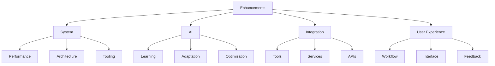

# Enhancement Proposals
Version: 1.0.0
Last Updated: [Timestamp]

## Proposal Categories 💡


## System Enhancements 🔧
### Performance Improvements
1. Memory Management
   ├── Current State: [Description]
   ├── Proposed Changes: [List]
   ├── Expected Impact: [Metrics]
   ├── Implementation: [Steps]
   ├── Priority: [High | Medium | Low]
   ├── Complexity: [⚡ 0-100]
   └── Timeline: [Estimate]

2. Response Time
   ├── Current State: [Description]
   ├── Proposed Changes: [List]
   ├── Expected Impact: [Metrics]
   ├── Implementation: [Steps]
   ├── Priority: [High | Medium | Low]
   ├── Complexity: [⚡ 0-100]
   └── Timeline: [Estimate]

## AI Enhancements 🤖
### Learning Capabilities
1. Pattern Recognition
   ├── Current State: [Description]
   ├── Proposed Changes: [List]
   ├── Expected Impact: [Metrics]
   ├── Implementation: [Steps]
   ├── Priority: [High | Medium | Low]
   ├── Complexity: [⚡ 0-100]
   └── Timeline: [Estimate]

2. Context Adaptation
   ├── Current State: [Description]
   ├── Proposed Changes: [List]
   ├── Expected Impact: [Metrics]
   ├── Implementation: [Steps]
   ├── Priority: [High | Medium | Low]
   ├── Complexity: [⚡ 0-100]
   └── Timeline: [Estimate]

## Integration Enhancements 🔄
### Tool Integration
1. MCP Tools
   ├── Current State: [Description]
   ├── Proposed Changes: [List]
   ├── Expected Impact: [Metrics]
   ├── Implementation: [Steps]
   ├── Priority: [High | Medium | Low]
   ├── Complexity: [⚡ 0-100]
   └── Timeline: [Estimate]

2. Development Tools
   ├── Current State: [Description]
   ├── Proposed Changes: [List]
   ├── Expected Impact: [Metrics]
   ├── Implementation: [Steps]
   ├── Priority: [High | Medium | Low]
   ├── Complexity: [⚡ 0-100]
   └── Timeline: [Estimate]

## User Experience Enhancements 👤
### Workflow Improvements
1. Task Execution
   ├── Current State: [Description]
   ├── Proposed Changes: [List]
   ├── Expected Impact: [Metrics]
   ├── Implementation: [Steps]
   ├── Priority: [High | Medium | Low]
   ├── Complexity: [⚡ 0-100]
   └── Timeline: [Estimate]

2. Feedback System
   ├── Current State: [Description]
   ├── Proposed Changes: [List]
   ├── Expected Impact: [Metrics]
   ├── Implementation: [Steps]
   ├── Priority: [High | Medium | Low]
   ├── Complexity: [⚡ 0-100]
   └── Timeline: [Estimate]

## Technical Proposals 💻
### Architecture Improvements
1. System Structure
   ```typescript
   interface ArchitectureProposal {
     current: {
       structure: string[];
       limitations: string[];
       issues: string[];
     };
     proposed: {
       structure: string[];
       benefits: string[];
       risks: string[];
     };
     implementation: {
       phases: string[];
       timeline: string;
       resources: string[];
     };
     metrics: {
       current: Record<string, number>;
       target: Record<string, number>;
       measurement: string[];
     };
   }
   ```

2. Code Organization
   ```typescript
   interface CodeProposal {
     current: {
       patterns: string[];
       issues: string[];
       limitations: string[];
     };
     proposed: {
       patterns: string[];
       benefits: string[];
       risks: string[];
     };
     implementation: {
       steps: string[];
       timeline: string;
       resources: string[];
     };
     metrics: {
       current: Record<string, number>;
       target: Record<string, number>;
       measurement: string[];
     };
   }
   ```

## Implementation Timeline 📅
### Short-term Goals (1-3 months)
1. Priority Enhancements
   ├── Enhancement: [Name]
   ├── Timeline: [Duration]
   ├── Resources: [List]
   └── Dependencies: [List]

2. Quick Wins
   ├── Enhancement: [Name]
   ├── Timeline: [Duration]
   ├── Resources: [List]
   └── Dependencies: [List]

### Long-term Goals (3-12 months)
1. Major Improvements
   ├── Enhancement: [Name]
   ├── Timeline: [Duration]
   ├── Resources: [List]
   └── Dependencies: [List]

2. System Evolution
   ├── Enhancement: [Name]
   ├── Timeline: [Duration]
   ├── Resources: [List]
   └── Dependencies: [List]

## Evaluation Criteria 📊
### Success Metrics
1. Performance Metrics
   ├── Current: [Metric]
   ├── Target: [Metric]
   ├── Measurement: [Method]
   └── Timeline: [Duration]

2. User Impact
   ├── Current: [Metric]
   ├── Target: [Metric]
   ├── Measurement: [Method]
   └── Timeline: [Duration]

## Change Log 📝
- [Timestamp]: [Change description]
- [Timestamp]: [Change description]
