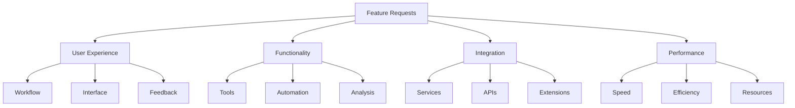

# Feature Requests
Version: 1.0.0
Last Updated: [Timestamp]

## Request Categories 📋


## User Experience Requests 👤
### Workflow Improvements
1. Request: [Feature Name]
   ├── Requested By: [Source]
   ├── Description: [Details]
   ├── Use Case: [Scenario]
   ├── Expected Benefit: [Impact]
   ├── Priority: [High | Medium | Low]
   ├── Complexity: [⚡ 0-100]
   ├── Dependencies: [List]
   └── Status: [Pending | Approved | In Progress | Completed]

2. Request: [Feature Name]
   ├── Requested By: [Source]
   ├── Description: [Details]
   ├── Use Case: [Scenario]
   ├── Expected Benefit: [Impact]
   ├── Priority: [High | Medium | Low]
   ├── Complexity: [⚡ 0-100]
   ├── Dependencies: [List]
   └── Status: [Pending | Approved | In Progress | Completed]

## Functionality Requests 🛠️
### Tool Enhancements
1. New Tool Request
   ```typescript
   interface ToolRequest {
     request: {
       name: string;
       description: string;
       useCase: string[];
       benefits: string[];
     };
     implementation: {
       requirements: string[];
       dependencies: string[];
       timeline: string;
     };
     analysis: {
       priority: 'High' | 'Medium' | 'Low';
       complexity: number;
       impact: string[];
     };
     status: {
       current: 'Pending' | 'Approved' | 'In Progress' | 'Completed';
       updates: string[];
       timeline: string;
     };
   }
   ```

2. Tool Improvement
   ```typescript
   interface ToolImprovement {
     current: {
       tool: string;
       limitations: string[];
       issues: string[];
     };
     requested: {
       changes: string[];
       benefits: string[];
       impact: string[];
     };
     implementation: {
       requirements: string[];
       timeline: string;
       risks: string[];
     };
     status: {
       current: 'Pending' | 'Approved' | 'In Progress' | 'Completed';
       updates: string[];
       blockers: string[];
     };
   }
   ```

## Integration Requests 🔄
### Service Integration
1. New Integration
   ├── Service: [Name]
   ├── Purpose: [Description]
   ├── Benefits: [List]
   ├── Requirements: [List]
   ├── Priority: [High | Medium | Low]
   ├── Complexity: [⚡ 0-100]
   ├── Dependencies: [List]
   └── Status: [Pending | Approved | In Progress | Completed]

2. Integration Enhancement
   ├── Current Integration: [Name]
   ├── Requested Changes: [List]
   ├── Benefits: [List]
   ├── Requirements: [List]
   ├── Priority: [High | Medium | Low]
   ├── Complexity: [⚡ 0-100]
   ├── Dependencies: [List]
   └── Status: [Pending | Approved | In Progress | Completed]

## Performance Requests ⚡
### Speed Improvements
1. Response Time
   ```typescript
   interface PerformanceRequest {
     area: {
       name: string;
       current: {
         metrics: Record<string, number>;
         issues: string[];
       };
     };
     requested: {
       improvements: string[];
       targets: Record<string, number>;
       benefits: string[];
     };
     implementation: {
       approach: string[];
       timeline: string;
       resources: string[];
     };
     status: {
       current: 'Pending' | 'Approved' | 'In Progress' | 'Completed';
       progress: number;
       blockers: string[];
     };
   }
   ```

2. Resource Usage
   ```typescript
   interface ResourceRequest {
     resource: {
       type: string;
       current: {
         usage: Record<string, number>;
         issues: string[];
       };
     };
     requested: {
       optimizations: string[];
       targets: Record<string, number>;
       benefits: string[];
     };
     implementation: {
       strategy: string[];
       timeline: string;
       dependencies: string[];
     };
     status: {
       current: 'Pending' | 'Approved' | 'In Progress' | 'Completed';
       progress: number;
       challenges: string[];
     };
   }
   ```

## Implementation Planning 📋
### Prioritization
1. High Priority
   ├── Request: [Name]
   ├── Impact: [Description]
   ├── Timeline: [Estimate]
   ├── Resources: [List]
   └── Dependencies: [List]

2. Quick Wins
   ├── Request: [Name]
   ├── Impact: [Description]
   ├── Timeline: [Estimate]
   ├── Resources: [List]
   └── Dependencies: [List]

## Request Status 📊
### Active Requests
1. In Progress
   ├── Request: [Name]
   ├── Status: [Details]
   ├── Progress: [%]
   ├── Blockers: [List]
   └── Next Steps: [List]

2. Pending Review
   ├── Request: [Name]
   ├── Status: [Details]
   ├── Dependencies: [List]
   ├── Blockers: [List]
   └── Next Steps: [List]

## Change Log 📝
- [Timestamp]: [Change description]
- [Timestamp]: [Change description]
