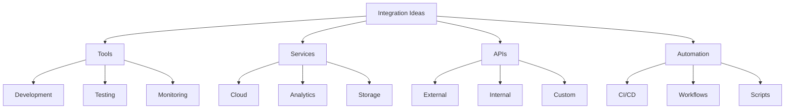

# Integration Ideas
Version: 1.0.0
Last Updated: [Timestamp]

## Integration Categories 🔄


## Tool Integrations 🛠️
### Development Tools
1. Code Analysis Tools
   ├── Purpose: [Description]
   ├── Benefits: [List]
   ├── Integration Points: [List]
   ├── Implementation: [Steps]
   ├── Priority: [High | Medium | Low]
   ├── Complexity: [⚡ 0-100]
   └── Timeline: [Estimate]

2. AI Development Tools
   ├── Purpose: [Description]
   ├── Benefits: [List]
   ├── Integration Points: [List]
   ├── Implementation: [Steps]
   ├── Priority: [High | Medium | Low]
   ├── Complexity: [⚡ 0-100]
   └── Timeline: [Estimate]

## Service Integrations ☁️
### Cloud Services
1. Data Services
   ```typescript
   interface DataServiceIntegration {
     service: {
       name: string;
       type: string;
       provider: string;
     };
     integration: {
       points: string[];
       methods: string[];
       security: string[];
     };
     implementation: {
       steps: string[];
       timeline: string;
       resources: string[];
     };
     benefits: {
       performance: string[];
       scalability: string[];
       cost: string[];
     };
   }
   ```

2. Analytics Services
   ```typescript
   interface AnalyticsIntegration {
     service: {
       name: string;
       type: string;
       metrics: string[];
     };
     integration: {
       points: string[];
       methods: string[];
       data: string[];
     };
     implementation: {
       steps: string[];
       timeline: string;
       resources: string[];
     };
     insights: {
       types: string[];
       usage: string[];
       value: string[];
     };
   }
   ```

## API Integrations 🔌
### External APIs
1. Third-Party Services
   ├── Service: [Name]
   ├── Purpose: [Description]
   ├── Integration Type: [REST | GraphQL]
   ├── Authentication: [Method]
   ├── Endpoints: [List]
   ├── Data Flow: [Description]
   └── Implementation: [Steps]

2. Platform APIs
   ├── Platform: [Name]
   ├── Purpose: [Description]
   ├── Integration Type: [REST | GraphQL]
   ├── Authentication: [Method]
   ├── Endpoints: [List]
   ├── Data Flow: [Description]
   └── Implementation: [Steps]

## Automation Ideas ⚙️
### CI/CD Improvements
1. Build Process
   ```typescript
   interface BuildAutomation {
     current: {
       process: string[];
       limitations: string[];
       bottlenecks: string[];
     };
     proposed: {
       process: string[];
       improvements: string[];
       benefits: string[];
     };
     implementation: {
       steps: string[];
       timeline: string;
       resources: string[];
     };
     metrics: {
       current: Record<string, number>;
       target: Record<string, number>;
       measurement: string[];
     };
   }
   ```

2. Deployment Process
   ```typescript
   interface DeploymentAutomation {
     current: {
       process: string[];
       limitations: string[];
       risks: string[];
     };
     proposed: {
       process: string[];
       improvements: string[];
       safeguards: string[];
     };
     implementation: {
       steps: string[];
       timeline: string;
       resources: string[];
     };
     metrics: {
       current: Record<string, number>;
       target: Record<string, number>;
       measurement: string[];
     };
   }
   ```

## MCP Tool Ideas 🤖
### New MCP Tools
1. Tool Concept
   ├── Purpose: [Description]
   ├── Capabilities: [List]
   ├── Integration Points: [List]
   ├── Implementation: [Steps]
   ├── Priority: [High | Medium | Low]
   ├── Complexity: [⚡ 0-100]
   └── Timeline: [Estimate]

2. Tool Enhancement
   ├── Current Tool: [Name]
   ├── Proposed Changes: [List]
   ├── Benefits: [List]
   ├── Implementation: [Steps]
   ├── Priority: [High | Medium | Low]
   ├── Complexity: [⚡ 0-100]
   └── Timeline: [Estimate]

## Integration Patterns 🎯
### Common Patterns
1. Data Integration
   ```typescript
   interface DataIntegrationPattern {
     pattern: {
       name: string;
       type: string;
       useCase: string[];
     };
     implementation: {
       steps: string[];
       requirements: string[];
       considerations: string[];
     };
     benefits: {
       efficiency: string[];
       reliability: string[];
       scalability: string[];
     };
     metrics: {
       performance: string[];
       quality: string[];
       impact: string[];
     };
   }
   ```

2. Service Integration
   ```typescript
   interface ServiceIntegrationPattern {
     pattern: {
       name: string;
       type: string;
       useCase: string[];
     };
     implementation: {
       steps: string[];
       requirements: string[];
       considerations: string[];
     };
     benefits: {
       efficiency: string[];
       reliability: string[];
       scalability: string[];
     };
     monitoring: {
       metrics: string[];
       alerts: string[];
       logging: string[];
     };
   }
   ```

## Implementation Timeline 📅
### Short-term Integrations
1. Priority Items
   ├── Integration: [Name]
   ├── Timeline: [Duration]
   ├── Resources: [List]
   └── Dependencies: [List]

2. Quick Wins
   ├── Integration: [Name]
   ├── Timeline: [Duration]
   ├── Resources: [List]
   └── Dependencies: [List]

## Change Log 📝
- [Timestamp]: [Change description]
- [Timestamp]: [Change description]
