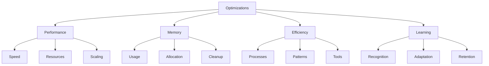

# Optimization Suggestions
Version: 1.0.0
Last Updated: [Timestamp]

## Optimization Categories ⚡


## Performance Optimizations 🚀
### Speed Improvements
1. Tool Execution
   ├── Current Performance: [Metrics]
   ├── Bottlenecks: [List]
   ├── Proposed Solutions: [List]
   ├── Expected Impact: [Metrics]
   ├── Implementation: [Steps]
   ├── Priority: [High | Medium | Low]
   ├── Complexity: [⚡ 0-100]
   └── Timeline: [Estimate]

2. Response Time
   ├── Current Performance: [Metrics]
   ├── Bottlenecks: [List]
   ├── Proposed Solutions: [List]
   ├── Expected Impact: [Metrics]
   ├── Implementation: [Steps]
   ├── Priority: [High | Medium | Low]
   ├── Complexity: [⚡ 0-100]
   └── Timeline: [Estimate]

## Memory Optimizations 💾
### Resource Management
1. Memory Usage
   ```typescript
   interface MemoryOptimization {
     current: {
       usage: {
         average: number;
         peak: number;
         patterns: string[];
       };
       issues: {
         leaks: string[];
         inefficiencies: string[];
         patterns: string[];
       };
     };
     proposed: {
       improvements: string[];
       expected: {
         average: number;
         peak: number;
         savings: number;
       };
       implementation: {
         steps: string[];
         timeline: string;
         risks: string[];
       };
     };
     monitoring: {
       metrics: string[];
       alerts: string[];
       thresholds: Record<string, number>;
     };
   }
   ```

2. Resource Allocation
   ```typescript
   interface ResourceOptimization {
     current: {
       allocation: {
         strategy: string;
         efficiency: number;
         issues: string[];
       };
       utilization: {
         average: number;
         peak: number;
         patterns: string[];
       };
     };
     proposed: {
       strategy: string;
       improvements: string[];
       expected: {
         efficiency: number;
         savings: number;
       };
     };
     implementation: {
       steps: string[];
       timeline: string;
       monitoring: string[];
     };
   }
   ```

## Process Optimizations ⚙️
### Workflow Improvements
1. Task Execution
   ├── Current Process: [Description]
   ├── Inefficiencies: [List]
   ├── Proposed Changes: [List]
   ├── Expected Impact: [Metrics]
   ├── Implementation: [Steps]
   ├── Priority: [High | Medium | Low]
   ├── Complexity: [⚡ 0-100]
   └── Timeline: [Estimate]

2. Tool Usage
   ├── Current Patterns: [Description]
   ├── Inefficiencies: [List]
   ├── Proposed Changes: [List]
   ├── Expected Impact: [Metrics]
   ├── Implementation: [Steps]
   ├── Priority: [High | Medium | Low]
   ├── Complexity: [⚡ 0-100]
   └── Timeline: [Estimate]

## Learning Optimizations 🧠
### Pattern Recognition
1. Recognition Speed
   ```typescript
   interface RecognitionOptimization {
     current: {
       speed: number;
       accuracy: number;
       patterns: string[];
     };
     bottlenecks: {
       identification: string[];
       processing: string[];
       application: string[];
     };
     improvements: {
       techniques: string[];
       expected: {
         speed: number;
         accuracy: number;
       };
     };
     implementation: {
       steps: string[];
       timeline: string;
       validation: string[];
     };
   }
   ```

2. Pattern Adaptation
   ```typescript
   interface AdaptationOptimization {
     current: {
       speed: number;
       success: number;
       limitations: string[];
     };
     improvements: {
       methods: string[];
       expected: {
         speed: number;
         success: number;
       };
     };
     implementation: {
       steps: string[];
       timeline: string;
       metrics: string[];
     };
   }
   ```

## Tool Optimizations 🛠️
### MCP Tool Improvements
1. Tool Performance
   ├── Current Metrics: [Stats]
   ├── Bottlenecks: [List]
   ├── Proposed Changes: [List]
   ├── Expected Impact: [Metrics]
   ├── Implementation: [Steps]
   ├── Priority: [High | Medium | Low]
   ├── Complexity: [⚡ 0-100]
   └── Timeline: [Estimate]

2. Tool Integration
   ├── Current State: [Description]
   ├── Inefficiencies: [List]
   ├── Proposed Changes: [List]
   ├── Expected Impact: [Metrics]
   ├── Implementation: [Steps]
   ├── Priority: [High | Medium | Low]
   ├── Complexity: [⚡ 0-100]
   └── Timeline: [Estimate]

## Implementation Strategy 📋
### Prioritization
1. High Priority
   ├── Optimization: [Name]
   ├── Impact: [High | Medium | Low]
   ├── Effort: [High | Medium | Low]
   ├── Dependencies: [List]
   └── Timeline: [Duration]

2. Quick Wins
   ├── Optimization: [Name]
   ├── Impact: [High | Medium | Low]
   ├── Effort: [High | Medium | Low]
   ├── Dependencies: [List]
   └── Timeline: [Duration]

## Monitoring & Metrics 📊
### Performance Tracking
1. Key Metrics
   ├── Metric: [Name]
   ├── Current: [Value]
   ├── Target: [Value]
   ├── Tracking: [Method]
   └── Alerts: [Conditions]

2. Improvement Tracking
   ├── Area: [Name]
   ├── Baseline: [Metrics]
   ├── Progress: [Metrics]
   ├── Goals: [Targets]
   └── Timeline: [Milestones]

## Change Log 📝
- [Timestamp]: [Change description]
- [Timestamp]: [Change description]
