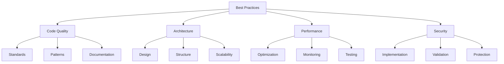

# Best Practices
Version: 1.0.0
Last Updated: [Timestamp]

## Practice Categories 📚


## Code Quality Standards 📋
### Coding Style
1. TypeScript/JavaScript
   ```typescript
   // Naming Conventions
   interface NamingConvention {
     variables: {
       format: 'camelCase';
       examples: string[];
       exceptions: string[];
     };
     functions: {
       format: 'camelCase';
       examples: string[];
       exceptions: string[];
     };
     classes: {
       format: 'PascalCase';
       examples: string[];
       exceptions: string[];
     };
     interfaces: {
       format: 'PascalCase';
       prefix: 'I' | none;
       examples: string[];
     };
     constants: {
       format: 'UPPER_SNAKE_CASE';
       examples: string[];
       exceptions: string[];
     };
   }

   // Function Structure
   interface FunctionGuidelines {
     maxLength: number;
     parameterCount: number;
     returnTypes: string[];
     documentation: {
       required: string[];
       format: string;
       examples: string[];
     };
   }
   ```

2. Code Organization
   ```typescript
   interface CodeStructure {
     fileOrganization: {
       imports: string[];
       constants: string[];
       types: string[];
       functions: string[];
       exports: string[];
     };
     componentStructure: {
       imports: string[];
       types: string[];
       constants: string[];
       hooks: string[];
       helpers: string[];
       component: string[];
     };
   }
   ```

## Architecture Guidelines 🏗️
### Design Principles
1. SOLID Principles
   ├── Single Responsibility: [Guidelines]
   ├── Open-Closed: [Guidelines]
   ├── Liskov Substitution: [Guidelines]
   ├── Interface Segregation: [Guidelines]
   └── Dependency Inversion: [Guidelines]

2. Clean Architecture
   ├── Layer Separation: [Guidelines]
   ├── Dependency Rules: [Guidelines]
   ├── Interface Adapters: [Guidelines]
   └── Use Cases: [Guidelines]

### Project Structure
1. Frontend Structure
   ```
   src/
   ├── components/
   │   ├── common/
   │   ├── features/
   │   └── layouts/
   ├── hooks/
   ├── utils/
   ├── services/
   ├── types/
   └── styles/
   ```

2. Backend Structure
   ```
   src/
   ├── controllers/
   ├── services/
   ├── models/
   ├── middleware/
   ├── utils/
   └── config/
   ```

## Performance Guidelines ⚡
### Frontend Optimization
1. React Performance
   ├── Component Optimization: [Guidelines]
   ├── State Management: [Guidelines]
   ├── Rendering Optimization: [Guidelines]
   └── Code Splitting: [Guidelines]

2. Loading Performance
   ├── Asset Optimization: [Guidelines]
   ├── Lazy Loading: [Guidelines]
   ├── Caching Strategies: [Guidelines]
   └── Bundle Optimization: [Guidelines]

### Backend Optimization
1. API Performance
   ├── Query Optimization: [Guidelines]
   ├── Caching Strategies: [Guidelines]
   ├── Rate Limiting: [Guidelines]
   └── Connection Pooling: [Guidelines]

2. Database Optimization
   ├── Index Optimization: [Guidelines]
   ├── Query Patterns: [Guidelines]
   ├── Connection Management: [Guidelines]
   └── Data Structure: [Guidelines]

## Security Standards 🔒
### Implementation Security
1. Frontend Security
   ├── Input Validation: [Guidelines]
   ├── XSS Prevention: [Guidelines]
   ├── CSRF Protection: [Guidelines]
   └── Authentication: [Guidelines]

2. Backend Security
   ├── Authentication: [Guidelines]
   ├── Authorization: [Guidelines]
   ├── Data Validation: [Guidelines]
   └── Error Handling: [Guidelines]

## Testing Guidelines 🧪
### Test Implementation
1. Unit Testing
   ├── Test Structure: [Guidelines]
   ├── Coverage Requirements: [Guidelines]
   ├── Mocking Strategies: [Guidelines]
   └── Assertion Patterns: [Guidelines]

2. Integration Testing
   ├── Test Scope: [Guidelines]
   ├── Setup Patterns: [Guidelines]
   ├── Data Management: [Guidelines]
   └── Cleanup Strategies: [Guidelines]

## Documentation Standards 📚
### Code Documentation
1. Function Documentation
   ```typescript
   /**
    * @description Brief description
    * @param {Type} paramName - Parameter description
    * @returns {Type} Return value description
    * @throws {Error} Error description
    * @example
    * ```typescript
    * // Usage example
    * ```
    */
   ```

2. Component Documentation
   ```typescript
   /**
    * @component ComponentName
    * @description Component description
    * @prop {Type} propName - Prop description
    * @example
    * ```tsx
    * // Usage example
    * ```
    */
   ```

## Error Handling 🚨
### Error Patterns
1. Frontend Errors
   ├── User Input Errors: [Guidelines]
   ├── Network Errors: [Guidelines]
   ├── State Errors: [Guidelines]
   └── Boundary Errors: [Guidelines]

2. Backend Errors
   ├── Validation Errors: [Guidelines]
   ├── Database Errors: [Guidelines]
   ├── Service Errors: [Guidelines]
   └── System Errors: [Guidelines]

## Change Log 📝
- [Timestamp]: [Change description]
- [Timestamp]: [Change description]
