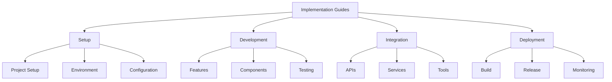

# Implementation Guides
Version: 1.0.0
Last Updated: [Timestamp]

## Guide Categories 📚


## Project Setup Guides 🚀
### New Project Setup
1. React TypeScript Project
   ```bash
   # Step-by-step setup
   1. Create project
      npx create-next-app@latest my-app --typescript

   2. Install dependencies
      cd my-app
      npm install @your/dependencies

   3. Configure TypeScript
      # tsconfig.json customizations
      {
        "compilerOptions": {
          // Recommended settings
        }
      }

   4. Setup linting
      # .eslintrc.js configuration
      {
        // Recommended rules
      }

   5. Initialize testing
      npm install jest @testing-library/react --save-dev
   ```

2. Project Structure Setup
   ```
   # Directory structure guide
   project-root/
   ├── src/
   │   ├── components/
   │   ├── hooks/
   │   ├── utils/
   │   └── types/
   ├── tests/
   ├── docs/
   └── config/
   ```

## Feature Implementation 🛠️
### Common Features
1. Authentication
   ```typescript
   // Authentication implementation
   interface AuthImplementation {
     setup: {
       dependencies: string[];
       configuration: object;
       environment: string[];
     };
     implementation: {
       steps: string[];
       codeExamples: string[];
       testing: string[];
     };
     security: {
       considerations: string[];
       bestPractices: string[];
     };
   }
   ```

2. Data Management
   ```typescript
   // Data management implementation
   interface DataImplementation {
     setup: {
       store: string[];
       models: string[];
       actions: string[];
     };
     implementation: {
       steps: string[];
       codeExamples: string[];
       testing: string[];
     };
     optimization: {
       caching: string[];
       performance: string[];
     };
   }
   ```

## Integration Guides 🔄
### API Integration
1. REST API Setup
   ```typescript
   // REST API implementation
   interface RESTImplementation {
     setup: {
       client: string[];
       interceptors: string[];
       types: string[];
     };
     implementation: {
       endpoints: string[];
       methods: string[];
       error handling: string[];
     };
     testing: {
       mocking: string[];
       validation: string[];
     };
   }
   ```

2. GraphQL Setup
   ```typescript
   // GraphQL implementation
   interface GraphQLImplementation {
     setup: {
       client: string[];
       schema: string[];
       types: string[];
     };
     implementation: {
       queries: string[];
       mutations: string[];
       subscriptions: string[];
     };
     optimization: {
       caching: string[];
       batching: string[];
     };
   }
   ```

## Component Development 🎨
### Component Patterns
1. Smart Components
   ```typescript
   // Smart component implementation
   interface SmartComponent {
     structure: {
       imports: string[];
       types: string[];
       hooks: string[];
     };
     implementation: {
       state: string[];
       effects: string[];
       handlers: string[];
     };
     optimization: {
       memoization: string[];
       rendering: string[];
     };
   }
   ```

2. Presentational Components
   ```typescript
   // Presentational component implementation
   interface PresentationalComponent {
     structure: {
       props: string[];
       styling: string[];
       composition: string[];
     };
     implementation: {
       rendering: string[];
       styling: string[];
       accessibility: string[];
     };
     optimization: {
       reusability: string[];
       performance: string[];
     };
   }
   ```

## Testing Implementation 🧪
### Test Setup
1. Unit Tests
   ```typescript
   // Unit test implementation
   interface UnitTestImplementation {
     setup: {
       framework: string[];
       configuration: string[];
       helpers: string[];
     };
     implementation: {
       structure: string[];
       patterns: string[];
       assertions: string[];
     };
     coverage: {
       requirements: string[];
       reporting: string[];
     };
   }
   ```

2. Integration Tests
   ```typescript
   // Integration test implementation
   interface IntegrationTestImplementation {
     setup: {
       environment: string[];
       dependencies: string[];
       configuration: string[];
     };
     implementation: {
       scenarios: string[];
       mocking: string[];
       assertions: string[];
     };
     automation: {
       ci: string[];
       reporting: string[];
     };
   }
   ```

## Deployment Guides 🚢
### Build Process
1. Production Build
   ```typescript
   // Build process implementation
   interface BuildImplementation {
     setup: {
       environment: string[];
       configuration: string[];
       optimization: string[];
     };
     implementation: {
       steps: string[];
       validation: string[];
       artifacts: string[];
     };
     automation: {
       scripts: string[];
       ci: string[];
     };
   }
   ```

2. Release Process
   ```typescript
   // Release process implementation
   interface ReleaseImplementation {
     setup: {
       environment: string[];
       versioning: string[];
       changelog: string[];
     };
     implementation: {
       steps: string[];
       validation: string[];
       rollback: string[];
     };
     monitoring: {
       metrics: string[];
       alerts: string[];
     };
   }
   ```

## Change Log 📝
- [Timestamp]: [Change description]
- [Timestamp]: [Change description]
