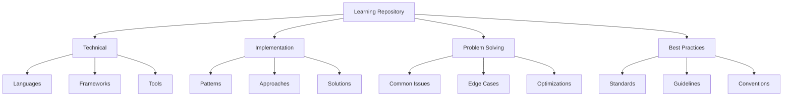

# Learning Repository
Version: 1.0.0
Last Updated: [Timestamp]

## Knowledge Categories 📚

## Technical Learnings 💡
### Language-Specific
1. TypeScript
   ├── Advanced Features: [List]
   ├── Common Pitfalls: [List]
   ├── Best Practices: [List]
   └── Performance Tips: [List]

2. JavaScript
   ├── Modern Features: [List]
   ├── Common Pitfalls: [List]
   ├── Best Practices: [List]
   └── Performance Tips: [List]

### Framework-Specific
1. React
   ├── Component Patterns: [List]
   ├── Performance Tips: [List]
   ├── Common Issues: [List]
   └── Solutions: [List]

2. Next.js
   ├── Architecture Patterns: [List]
   ├── Performance Tips: [List]
   ├── Common Issues: [List]
   └── Solutions: [List]

## Implementation Learnings 🛠️
### Successful Patterns
1. Frontend Patterns
   ├── Pattern: [Name]
   ├── Use Case: [Description]
   ├── Benefits: [List]
   └── Implementation: [Guide]

2. Backend Patterns
   ├── Pattern: [Name]
   ├── Use Case: [Description]
   ├── Benefits: [List]
   └── Implementation: [Guide]

### Failed Approaches
1. Anti-Patterns
   ├── Pattern: [Name]
   ├── Issue: [Description]
   ├── Impact: [Analysis]
   └── Alternative: [Solution]

2. Performance Issues
   ├── Issue: [Description]
   ├── Cause: [Analysis]
   ├── Impact: [Metrics]
   └── Solution: [Approach]

## Problem-Solving Insights 🔍
### Common Challenges
1. Technical Challenges
   ├── Problem: [Description]
   ├── Context: [Details]
   ├── Solution: [Approach]
   └── Learning: [Insights]

2. Integration Challenges
   ├── Problem: [Description]
   ├── Context: [Details]
   ├── Solution: [Approach]
   └── Learning: [Insights]

### Edge Cases
1. Data Handling
   ├── Scenario: [Description]
   ├── Challenge: [Details]
   ├── Solution: [Approach]
   └── Prevention: [Strategy]

2. User Interactions
   ├── Scenario: [Description]
   ├── Challenge: [Details]
   ├── Solution: [Approach]
   └── Prevention: [Strategy]

## Best Practices Collection 📖
### Code Standards
1. Style Guidelines
   ├── Language: [Name]
   ├── Rules: [List]
   ├── Examples: [Code]
   └── Tools: [List]

2. Documentation Standards
   ├── Format: [Style]
   ├── Requirements: [List]
   ├── Examples: [Samples]
   └── Tools: [List]

### Architecture Guidelines
1. Frontend Architecture
   ├── Principles: [List]
   ├── Patterns: [List]
   ├── Anti-patterns: [List]
   └── Examples: [References]

2. Backend Architecture
   ├── Principles: [List]
   ├── Patterns: [List]
   ├── Anti-patterns: [List]
   └── Examples: [References]

## Performance Optimizations ⚡
### Frontend Performance
1. Loading Optimization
   ├── Technique: [Description]
   ├── Implementation: [Steps]
   ├── Impact: [Metrics]
   └── Trade-offs: [List]

2. Runtime Optimization
   ├── Technique: [Description]
   ├── Implementation: [Steps]
   ├── Impact: [Metrics]
   └── Trade-offs: [List]

### Backend Performance
1. Query Optimization
   ├── Technique: [Description]
   ├── Implementation: [Steps]
   ├── Impact: [Metrics]
   └── Trade-offs: [List]

2. Caching Strategies
   ├── Technique: [Description]
   ├── Implementation: [Steps]
   ├── Impact: [Metrics]
   └── Trade-offs: [List]

## Security Learnings 🔒
### Common Vulnerabilities
1. Frontend Security
   ├── Vulnerability: [Type]
   ├── Risk: [Assessment]
   ├── Prevention: [Steps]
   └── Testing: [Methods]

2. Backend Security
   ├── Vulnerability: [Type]
   ├── Risk: [Assessment]
   ├── Prevention: [Steps]
   └── Testing: [Methods]

## Testing Strategies 🧪
### Effective Approaches
1. Unit Testing
   ├── Approach: [Description]
   ├── Tools: [List]
   ├── Best Practices: [List]
   └── Examples: [Code]

2. Integration Testing
   ├── Approach: [Description]
   ├── Tools: [List]
   ├── Best Practices: [List]
   └── Examples: [Code]

## Change Log 📝
- [Timestamp]: [Change description]
- [Timestamp]: [Change description]
