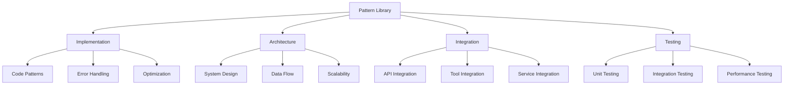

# Pattern Library
Version: 1.0.0
Last Updated: [Timestamp]

## Pattern Categories 🗂️


## Implementation Patterns 🛠️
### Code Patterns
1. Component Structure
   ```typescript
   interface ComponentPattern {
     name: string;
     useCase: string[];
     structure: {
       imports: string[];
       props: {
         required: string[];
         optional: string[];
       };
       state: {
         local: string[];
         global: string[];
       };
       methods: {
         lifecycle: string[];
         handlers: string[];
         utilities: string[];
       };
     };
     performance: {
       optimizations: string[];
       considerations: string[];
     };
     examples: {
       basic: string;
       advanced: string;
     };
   }
   ```

2. State Management
   ```typescript
   interface StatePattern {
     pattern: string;
     complexity: number;
     useCase: string[];
     implementation: {
       setup: string[];
       management: string[];
       updates: string[];
     };
     performance: {
       considerations: string[];
       optimizations: string[];
     };
     examples: {
       simple: string;
       complex: string;
     };
   }
   ```

## Architecture Patterns 🏗️
### System Design
1. Service Architecture
   ```typescript
   interface ServicePattern {
     pattern: string;
     useCase: string[];
     structure: {
       services: string[];
       communication: string[];
       dataFlow: string[];
     };
     scalability: {
       considerations: string[];
       solutions: string[];
     };
     examples: {
       basic: string;
       scaled: string;
     };
   }
   ```

2. Data Flow
   ```typescript
   interface DataFlowPattern {
     pattern: string;
     useCase: string[];
     flow: {
       inputs: string[];
       processing: string[];
       outputs: string[];
     };
     optimization: {
       caching: string[];
       batching: string[];
     };
     examples: {
       simple: string;
       complex: string;
     };
   }
   ```

## Integration Patterns 🔄
### API Integration
1. REST Patterns
   ```typescript
   interface RESTPattern {
     pattern: string;
     useCase: string[];
     implementation: {
       endpoints: string[];
       methods: string[];
       auth: string[];
     };
     errorHandling: {
       strategies: string[];
       recovery: string[];
     };
     examples: {
       basic: string;
       secured: string;
     };
   }
   ```

2. GraphQL Patterns
   ```typescript
   interface GraphQLPattern {
     pattern: string;
     useCase: string[];
     implementation: {
       queries: string[];
       mutations: string[];
       subscriptions: string[];
     };
     optimization: {
       caching: string[];
       batching: string[];
     };
     examples: {
       basic: string;
       optimized: string;
     };
   }
   ```

## Testing Patterns 🧪
### Unit Testing
1. Component Testing
   ```typescript
   interface TestPattern {
     pattern: string;
     useCase: string[];
     implementation: {
       setup: string[];
       execution: string[];
       assertions: string[];
     };
     coverage: {
       scenarios: string[];
       edges: string[];
     };
     examples: {
       simple: string;
       complex: string;
     };
   }
   ```

2. Integration Testing
   ```typescript
   interface IntegrationTestPattern {
     pattern: string;
     useCase: string[];
     implementation: {
       setup: string[];
       execution: string[];
       cleanup: string[];
     };
     coverage: {
       flows: string[];
       boundaries: string[];
     };
     examples: {
       basic: string;
       advanced: string;
     };
   }
   ```

## Performance Patterns ⚡
### Optimization
1. Code Optimization
   ```typescript
   interface OptimizationPattern {
     pattern: string;
     useCase: string[];
     implementation: {
       analysis: string[];
       improvements: string[];
       validation: string[];
     };
     metrics: {
       before: string[];
       after: string[];
     };
     examples: {
       simple: string;
       complex: string;
     };
   }
   ```

2. Resource Management
   ```typescript
   interface ResourcePattern {
     pattern: string;
     useCase: string[];
     implementation: {
       allocation: string[];
       monitoring: string[];
       cleanup: string[];
     };
     optimization: {
       strategies: string[];
       tools: string[];
     };
     examples: {
       basic: string;
       optimized: string;
     };
   }
   ```

## Error Handling Patterns 🚨
### Recovery Strategies
1. Automatic Recovery
   ```typescript
   interface RecoveryPattern {
     pattern: string;
     useCase: string[];
     implementation: {
       detection: string[];
       recovery: string[];
       prevention: string[];
     };
     monitoring: {
       metrics: string[];
       alerts: string[];
     };
     examples: {
       simple: string;
       robust: string;
     };
   }
   ```

2. Graceful Degradation
   ```typescript
   interface DegradationPattern {
     pattern: string;
     useCase: string[];
     implementation: {
       levels: string[];
       triggers: string[];
       recovery: string[];
     };
     monitoring: {
       health: string[];
       metrics: string[];
     };
     examples: {
       basic: string;
       advanced: string;
     };
   }
   ```

## Change Log 📝
- [Timestamp]: [Change description]
- [Timestamp]: [Change description]
